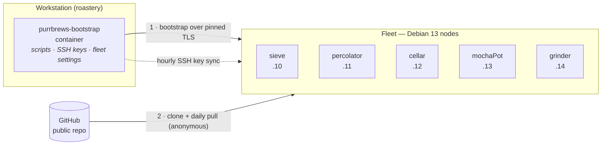

# purrbrews-containers

**A self-hosted home server fleet, written down as code.**

PurrBrews is a small, multi-node home lab built to replace everyday cloud services —
photos, files, passwords, documents, recipes, budgets, home automation — with ones that
run at home. It aims for three things:

1. **Quality of life.** Services that are pleasant to use every day, with single sign-on,
   real hostnames and nothing to babysit.
2. **Low maintenance.** Rebuilding a machine should take one command and a coffee, not
   a weekend. Everything is scripted, idempotent and safe to re-run.
3. **Household approval.** If the family notices the home lab, it's because something
   got better, not because the internet broke.

This repository holds all of it: how a bare Debian machine becomes a fleet node, and the
Docker Compose stacks each node runs.

---

## How it fits together



1. **Bootstrap.** A fresh node runs a one-liner against a small container on the
   workstation. The container serves the setup scripts, the public SSH keys and the fleet
   settings over TLS, and the node pins its key on first contact.
2. **Provision.** `init/purrbrews-init.sh` hardens the OS, installs Docker, gives the node
   its static IP and fixed MAC, clones this repo to `/opt/purrbrews` and sets up timers.
3. **Run.** Each node brings up its own stacks from `stacks/<node>/`. Secrets are
   generated on the node and never leave it.
4. **Stay current.** Nodes fast-forward the repo daily and re-sync SSH keys hourly.
   Adding or revoking a key is a one-line edit in one place.

## The fleet

Nodes are named after coffee gear.

| Node | Address | Cloned MAC |
|---|---|---|
| `sieve` | 192.168.0.10 | `02:33:68:72:0b:17` |
| `percolator` | 192.168.0.11 | `02:11:c2:56:e8:96` |
| `cellar` | 192.168.0.12 | `02:ba:2e:ea:5e:48` |
| `mochaPot` | 192.168.0.13 | `02:ff:72:b2:8f:c4` |
| `grinder` | 192.168.0.14 | `02:93:3c:b4:86:e8` |

Each node's role and app list live in its `stacks/<node>/README.md` as stacks are added.
So far: [`sieve`](stacks/sieve/README.md) — Pi-hole (DNS + DHCP), Unbound, cloudflared,
ntfy, Gatus, NetAlertX; [`percolator`](stacks/percolator/README.md) — Traefik, CrowdSec,
LLDAP, Authelia, Vaultwarden, Nextcloud, Immich, Paperless-ngx, Mealie, Vikunja,
Actual Budget, FreshRSS, Homepage; [`cellar`](stacks/cellar/README.md) — Traefik, restic,
Samba/NFS, Scrutiny, Komodo Core + Mongo; [`mochaPot`](stacks/mochaPot/README.md) —
Traefik, Home Assistant, Music Assistant, Pi-hole (secondary), kiosk browser;
[`grinder`](stacks/grinder/README.md) — Traefik, n8n, embedding worker, Open WebUI,
Karakeep, FitTrackee, Traccar, ESPHome dashboard, Speedtest Tracker.
MACs are derived from the node name, so a reinstall or NIC swap never changes how the
network sees a machine (see [`init/README.md`](init/README.md)).

## Repository layout

```
bootstrap/                               workstation container that serves node setup on the LAN
init/                                    fresh Debian → ready node: hardening, Docker, network, timers
stacks/<node>/<app>/docker-compose.yml   one folder per app, grouped by the node it runs on
stacks/<node>/compose.sh                 wrapper: loads the node's .env.local + the app's secrets.env.local
stacks/<node>/setup-secrets.sh           one-command node prep: settings, data dirs, secrets
stacks/<node>/generate-secrets.sh        creates each app's secrets locally, on the node
stacks/<node>/firewall.sh                the node's UFW rules, as code
stacks/<node>/local.env.example          node-specific settings template
runbook.md                               dated design decisions: the why, not just the what
docs/                                    plans and audits; start at docs/MAP.md
```

## Current network audit

**Delivery rule:** commit and push changes to Git, then pull them on the nodes.
Do not copy configuration or code directly to servers. Generated configuration
and secrets remain local to each node.

See [the September 2026 audit](docs/network-audit.md) for verified DNS/IPv6
findings, repository fixes, remaining live failures, and the staged rollout.

## Getting started

**1. Start the bootstrap container** on the workstation (Docker Desktop is fine):

```powershell
cd bootstrap
mkdir data
Copy-Item ..\init\purrbrews-init.env.example data\purrbrews-init.env
Copy-Item $HOME\.ssh\id_ed25519.pub data\authorized_keys
docker compose up -d --build
docker compose logs bootstrap          # note the TLS pin
```

Full details, including the firewall rule, are in [`bootstrap/README.md`](bootstrap/README.md).

**2. Provision a node.** Install Debian 13 (netinst, SSH server), then on the node run:

```bash
wget -qO- --no-check-certificate https://<workstation-ip>:8443/bootstrap.sh | sudo bash -s -- sieve
```

Confirm the TLS pin, set the ops user's sudo password, and reconnect with
`ssh barista@192.168.0.10`. See [`init/README.md`](init/README.md) for everything
the script does.

**3. Bring up the node's stacks** from `/opt/purrbrews/stacks/<node>/`, following that
node's README.

## Design principles

- **Public by design.** This repo is public, and nodes clone it anonymously. Nothing
  secret is ever committed: no passwords, tokens, API keys, private keys or password
  hashes, not even encrypted. `*.example` and `*.template` files carry `REPLACE_ME`
  placeholders instead.
- **Secrets are born on the node.** Each node's `generate-secrets.sh` writes real values
  into gitignored `secrets.env.local` files. Nothing to distribute, nothing to leak in
  transit.
- **Idempotent everything.** Every script checks current state before changing it.
  Re-running is the supported way to repair or update.
- **Changes that can't strand a headless box.** Network changes run detached and roll
  back within a minute if the gateway doesn't answer. SSH lock-down refuses to proceed
  until a key is installed.
- **Small blast radius.** Every node runs its own Traefik for its own apps; only the
  login (Authelia on percolator, reached on its firewalled port 9091) is shared. A
  broken proxy or a dead node takes down that node's pages, not the fleet's.
- **Least privilege.** Key-only SSH, no root login, and the ops user reaches root only
  through a password-gated `sudo`. The ops user is never in the `docker` group, which
  would be root without a password.
- **Pinned and verified.** Image tags and downloaded tools are pinned, and third-party
  scripts are checked against a SHA-256 before they run.
- **Written down.** Decisions go in [`runbook.md`](runbook.md) with their reasons, so
  the future self who has to fix something at midnight knows why it is the way it is.

## Adapting it

The layout generalizes to any small fleet. Change `NODE_IPS`, the gateway and the
timezone in `init/purrbrews-init.env.example`, put your own public keys in
`bootstrap/data/authorized_keys`, and replace `stacks/` with your nodes.

Before pushing to a public fork, turn on GitHub's **Secret scanning** and
**Push protection**. If a secret ever slips through, rotate it first: deleting the
commit does not un-publish it.

## Working on Windows

The repo is authored on Windows and deployed to Linux. `.gitattributes` forces LF line
endings so shell scripts and YAML survive a Windows checkout, and `.editorconfig` keeps
editors consistent with that.
