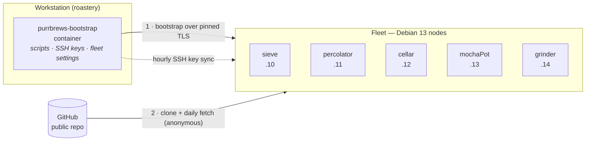

# purrbrews-containers

**A self-hosted home server fleet, written down as code.**

PurrBrews is a small, multi-node home lab built to replace everyday cloud services —
photos, files, passwords, documents, recipes, budgets, home automation — with ones that
run at home. It aims for three things:

1. **Quality of life.** Services that are pleasant to use every day, with single sign-on,
   real hostnames and nothing to babysit.
2. **Low maintenance.** Rebuilding a machine should take one command and a coffee, not
   a weekend. Everything is scripted, idempotent and safe to re-run.
3. **Household approval.** If the family notices the home lab, it's because something
   got better, not because the internet broke.

This repository holds all of it: how a bare Debian machine becomes a fleet node, and the
Docker Compose stacks each node runs.

---

## How it fits together


```mermaid
flowchart LR
    subgraph ws["Workstation (roastery)"]
        B["purrbrews-bootstrap<br/>container<br/><i>scripts · SSH keys · fleet settings</i>"]
    end
    GH[("GitHub<br/>public repo")]
    subgraph fleet["Fleet — Debian 13 nodes"]
        N1["sieve<br/>.10"]
        N2["percolator<br/>.11"]
        N3["cellar<br/>.12"]
        N4["mochaPot<br/>.13"]
        N5["grinder<br/>.14"]
    end
    B -- "1 · bootstrap over pinned TLS" --> fleet
    GH -- "2 · clone + daily fetch (anonymous)" --> fleet
    B -. "hourly SSH key sync" .-> fleet
```

1. **Bootstrap.** A fresh node runs a one-liner against a small container on the
   workstation. The container serves the setup scripts, the public SSH keys and the fleet
   settings over TLS, and the node pins its key on first contact.
2. **Provision.** `init/purrbrews-init.sh` hardens the OS, installs Docker, gives the node
   its static IP and fixed MAC, clones this repo to `/opt/purrbrews` and sets up timers.
3. **Run.** Each node brings up its own stacks from `stacks/<node>/`. Secrets are
   generated on the node; recovery copies belong only in encrypted backups.
4. **Stay current.** Nodes fetch release candidates daily and re-sync SSH keys hourly.
   Reviewed revisions are deployed explicitly; scheduled jobs keep using the selected checkout.
   Adding or revoking a key is a one-line edit in one place.

## The fleet

Nodes are named after coffee gear.

| Node | Address | Cloned MAC |
|---|---|---|
| `sieve` | 192.168.0.10 | `02:33:68:72:0b:17` |
| `percolator` | 192.168.0.11 | `02:11:c2:56:e8:96` |
| `cellar` | 192.168.0.12 | `02:ba:2e:ea:5e:48` |
| `mochaPot` | 192.168.0.13 | `02:ff:72:b2:8f:c4` |
| `grinder` | 192.168.0.14 | `02:93:3c:b4:86:e8` |

Each node's role, apps and bring-up order are in its `stacks/<node>/README.md`:
[`sieve`](stacks/sieve/README.md) (Pi-hole DNS + DHCP, Unbound, cloudflared, ntfy, Gatus,
NetAlertX), [`percolator`](stacks/percolator/README.md) (Traefik, CrowdSec, LLDAP,
Authelia, Vaultwarden, Nextcloud, Immich, Paperless-ngx, Mealie, Vikunja, Actual Budget,
FreshRSS, Homepage), [`cellar`](stacks/cellar/README.md) (Komodo, Scrutiny hub, restic,
Samba/NFS), [`mochaPot`](stacks/mochaPot/README.md) (Home Assistant, Music Assistant,
secondary Pi-hole, the wall screen) and [`grinder`](stacks/grinder/README.md) (n8n,
pgvector and an embedding worker, Open WebUI, Karakeep, FitTrackee, Traccar, ESPHome,
Speedtest Tracker). Every node also runs its own Traefik, a Komodo Periphery agent and
a Scrutiny collector. The workstation, [`roastery`](stacks/roastery/README.md), lends
its GPU to Immich and to the local LLMs (llama-swap, which replaced Ollama).

The [runbook](runbook.md) records successful restore tests from roastery and
Google Drive on 2026-09-29, followed by a clean overnight backup cycle on
2026-09-30. roastery was then wiped on 2026-10-07; its rebuild requires restoring
the backup repository before authorizing the nodes' keys. Use the Backlog and
newest entries for recorded progress; these documents do not confirm live state.

MACs are derived from the node name, so a reinstall or NIC swap never changes how the
network sees a machine (see [`init/README.md`](init/README.md)).

From outside the house, every node and roastery are on a Tailscale tailnet: SSH to
the nodes and Remote Desktop to roastery, with no port open on the router
([`tailscale/README.md`](tailscale/README.md)).

## Repository layout

```
bootstrap/                  workstation container that serves node setup on the LAN
init/                       Debian provisioning and roastery's Windows rebuild entry point
stacks/fleet.env            LAN facts every node shares
stacks/_lib/                the scripts every node uses: setup, render, compose, firewall
stacks/<node>/node.conf     that node's apps in bring-up order, its network, its DNS role
stacks/<node>/scripts/      one-off node tasks and the plan/deploy runner
scripts/                    fleet planning, deployment and image verification
fleet.json                  node policy and deployment prerequisites
image-lock.json             reviewed registry tags and exact digests
stacks/<node>/<app>/        docker-compose.yml, plus secrets.conf / firewall / data-dirs as needed
tailscale/                  remote access: the tailnet policy and how every machine joins
runbook.md                  dated decisions and the backlog: the why, not just the what
docs/                       audits and the map of everything; start at docs/MAP.md
Deprecated/                 archive index; retired files keep their original relative paths
tests/                      offline checks: python3 -m unittest discover -s tests
```

Adding an app to a node is a folder and one line in `node.conf`; no script needs
editing. [`stacks/README.md`](stacks/README.md) has the details.

The [cleanup review](docs/cleanup-review.md) explains retained components and
possible follow-ups. `graphify-out/`, when present, is ignored local analysis
output; regenerate it after relevant source changes before relying on its map.

## Current network audit

**Delivery rule:** commit and push changes to Git, then pull them on the nodes.
Do not copy configuration or code directly to servers. Generated configuration
and secrets remain local to each node.

See [the September 2026 audit](docs/network-audit.md) for verified DNS/IPv6
findings, repository fixes, remaining live failures, and the staged rollout.

## Getting started

**1. Start the bootstrap container** on the workstation (Docker Desktop is fine):

```powershell
cd bootstrap
mkdir data
Copy-Item ..\init\purrbrews-init.env.example data\purrbrews-init.env
Copy-Item $HOME\.ssh\id_ed25519.pub data\authorized_keys
docker compose up -d --build
docker compose logs bootstrap          # note the TLS pin
```

Full details, including the firewall rule, are in [`bootstrap/README.md`](bootstrap/README.md).

**2. Provision a node.** Install Debian 13 (netinst, SSH server), then on the node run:

```bash
wget -qO- --no-check-certificate https://<workstation-ip>:8443/bootstrap.sh | sudo bash -s -- sieve
```

Confirm the TLS pin, set the ops user's sudo password, and reconnect with
`ssh barista@192.168.0.10`. See [`init/README.md`](init/README.md) for everything
the script does.

**3. Bring up the node's stacks** from `/opt/purrbrews/stacks/<node>/`, following that
node's README. Preview the ordered bring-up:

```bash
bash scripts/run.sh
```

Pass `--release <full-commit-id> --acknowledge-prerequisites` to execute
setup/render, firewall, then Compose in `node.conf` order. Read the
[operations guide](docs/operations.md) and [image upgrade gates](docs/image-upgrades.md)
before deploying; first-time manual checkpoints remain in each node README.

## Design principles

- **Public by design.** This repo is public, and nodes clone it anonymously. Nothing
  secret is ever committed: no passwords, tokens, API keys, private keys or password
  hashes, not even encrypted. `*.example` and `*.template` files carry `REPLACE_ME`
  placeholders instead.
- **Secrets are born on the node.** `setup-secrets.sh` reads each app's `secrets.conf`
  and writes real values into gitignored `secrets.env.local` files. Nothing to
  distribute through Git. Encrypted recovery backups also contain these files.
- **Repeatable operations.** Shared helpers preserve existing values and check
  prerequisites. Failed deployments record completed phases; inspect partial
  changes before retrying.
- **Changes that can't strand a headless box.** Network changes run detached and roll
  back within a minute if the gateway doesn't answer. SSH lock-down refuses to proceed
  until a key is installed.
- **Small blast radius.** Every node runs its own Traefik for its own apps; only the
  login (Authelia on percolator, reached on its firewalled port 9091) is shared. A
  broken proxy or a dead node takes down that node's pages, not the fleet's.
- **Least privilege.** Key-only SSH, no root login, and the ops user reaches root only
  through a password-gated `sudo`. Membership in the `docker` group is equivalent to root; the runbook
  records an outstanding decision about existing membership on the fleet.
- **Pinned and verified.** Image tags and downloaded tools are pinned, and third-party
  scripts are checked against a SHA-256 before they run.
- **The same everywhere.** One set of scripts for every node; what differs lives in
  `node.conf` and each app's own files. If a node needs special handling, that's a
  setting, not a fork of the script.
- **Written down.** Decisions go in [`runbook.md`](runbook.md) with their reasons, so
  the future self who has to fix something at midnight knows why it is the way it is.

## Adapting it

The layout generalizes to any small fleet. Change `NODE_IPS`, the gateway and the
timezone in `init/purrbrews-init.env.example` and `stacks/fleet.env`, put your own
public keys in `bootstrap/data/authorized_keys`, and replace the node folders under
`stacks/` with your own (keeping `_lib`).

Before pushing to a public fork, turn on GitHub's **Secret scanning** and
**Push protection**. If a secret ever slips through, rotate it first: deleting the
commit does not un-publish it.

## Working on Windows

The repo is authored on Windows and deployed to Linux. `.gitattributes` forces LF line
endings so shell scripts and YAML survive a Windows checkout, and `.editorconfig` keeps
editors consistent with that.
