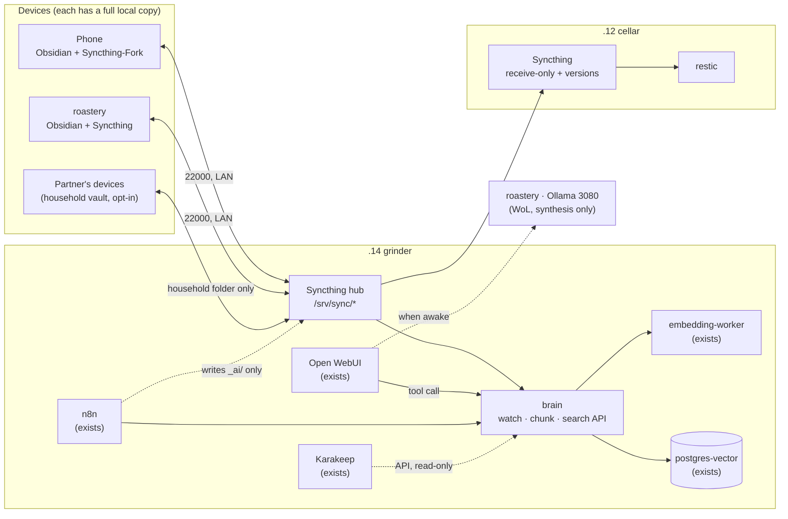

# Second brain — design plan

**Status:** proposed, 2026-09-26. Nothing here is built yet. Decisions are recorded in
[`runbook.md`](../../runbook.md) (entry "2026-09-26 — Second brain: design plan") and
the work items are in its backlog, unticked until there is evidence.

**Where it fits:** the fleet already reserves grinder as the "second brain" node.
`postgres-vector`, `embedding-worker`, `n8n`, `openwebui` and `karakeep` are in
`stacks/grinder/`, and the pipeline shape (capture → index → synthesise) comes from
the private `edge-and-automation.md` notes: *"embeddings + pgvector on CPU, always on.
Only synthesis needs the 3080, via WoL."* This plan keeps that shape. It adds the one
thing that pipeline was always missing: **the notes vault itself**, and how people
actually get thoughts into it.

---

## 1. Goals and non-goals

### Goals

1. **Capture takes under 10 seconds and needs no decisions.** No choosing a folder, tag
   or title at capture time. Everything goes to one inbox.
2. **Everything is findable without filing it.** Full-text search on every device,
   semantic search ("what did I decide about the cats' food?") on the LAN. Filing is
   optional. Retrieval never depends on it.
3. **Ownership.** Plain Markdown files on disks in this house. They can be read with any
   text editor and survive any app going away. No cloud account is needed to read your
   own notes.
4. **Automation removes chores, never control.** Machines may *suggest* links, tags,
   digests and archiving. They never rewrite something a human wrote. Every automated
   action is reversible and leaves a trace.
5. **Works when parts of the fleet are down.** Notes are local on every device. grinder
   going down loses semantic search, not notes. roastery asleep loses AI synthesis,
   not search.
6. **Two people, clean boundaries.** Each person's private notes stay private,
   including from the AI layer. A shared household space covers the cats, the flats
   and joint plans.

### Non-goals

- **Not a task manager.** Tasks live in Vikunja. The weekly review moves actionable
  items there.
- **Not a document archive.** Paperless-ngx keeps scans, bills and warranties. Notes
  link to them.
- **Not a photo store.** Immich keeps screenshots and photos. Notes link to them.
- **Not a bookmark store.** Karakeep keeps links and read-later items. They are
  indexed, not copied.
- **Not a password store.** Vaultwarden. Notes never contain secrets (Wi-Fi keys,
  PINs, recovery codes).
- **No perfect system first.** No PARA/Zettelkasten purity and no 40-folder taxonomy
  before real use shows it's needed. The known failure mode of PKM projects is
  building the system instead of using it (see §13, risk R1).
- **No public access in the MVP.** LAN only; see the open question on away-from-home
  sync.
- **No cloud LLMs on vault content.** Claude and ChatGPT help build *this system*.
  They only see note content the user pastes in on purpose.

---

## 2. The recommendation in one paragraph

**Obsidian as the editor, a plain-Markdown vault, synced by Syncthing.** grinder is the
always-on hub. cellar holds a receive-only, versioned replica, which is also restic's
backup source. **Karakeep** keeps links, **Paperless** documents and **Immich**
screenshots. One small new service on grinder, **`brain`**, watches the vault, chunks
and embeds it through the existing `embedding-worker` into the existing
`postgres-vector`, and answers search queries. **Open WebUI** calls `brain` as a tool.
Retrieval runs on CPU at all times. Answers are written by Ollama on roastery's 3080 when
roastery is awake, and search-only results come back when it isn't. **n8n** handles the
routines: the weekly digest, inbox auto-archive, conflict detection and ntfy nudges.



---

## 3. What already exists and what this plan respects

| Existing thing | Where | How the plan uses it |
|---|---|---|
| grinder = second-brain node, "nothing household-critical, cheap to shed" | `stacks/grinder/README.md` | Hub and index live here. Because it is shed-able, grinder is **never the only copy**: devices and cellar hold full replicas. |
| `postgres-vector` (pgvector, no published port) | grinder | Store for chunk embeddings, in a dedicated `brain` schema. |
| `embedding-worker` (`BAAI/bge-small-en-v1.5`, 384-dim, CPU, `grinder_net` only) | grinder | Used as is. The model choice is open question Q4. |
| n8n (SQLite state, reaches `postgres-vector` by name) | grinder | Scheduling and glue: digest, archive, reminders. |
| Open WebUI (`chat.${DOMAIN}`, own accounts, image `:main`) | grinder | Chat front end over the notes, via a tool server. |
| Karakeep (`karakeep.${DOMAIN}`) | grinder | Web capture. Indexed via its API in phase 4. |
| Ollama on roastery, localhost-only behind Traefik + Authelia; `ollama_api_group` one-factor rule | roastery, percolator | Synthesis. **Blocker:** grinder has no working machine-to-machine path to Ollama yet (`stacks/roastery/traefik/README.md`, "API clients and Open WebUI"). See Q6. |
| WoL-then-wait pattern | `stacks/cellar/restic/mirror-to-roastery.sh` | Adapted for "wake roastery for an answer". |
| restic on cellar, no sources wired; backups unfinished (2026-09-25) | cellar | Vault replica becomes a restic source. The plan gates the AI phases on a passing restore test. |
| ntfy (sieve), Gatus (sieve) | sieve | Review nudges and health checks. |
| Vikunja, Paperless, Immich, Mealie | percolator | Destinations and link targets. Not duplicated into notes. |
| Rules: public repo, no secrets, Git-only delivery, Traefik per node, Authelia central, pinned images, dated runbook | everywhere | Every new service follows `compose.sh` / `generate-secrets.sh` / `firewall.sh` conventions. |

**Hardware headroom** (from each node's README):

- **grinder:** i5 7th gen (2c/4t), 16 GB RAM, 512 GB NVMe. It runs nine apps; the
  heavy ones are Karakeep's Chrome and Meilisearch. Syncthing (~100–200 MB) and `brain`
  (~300–500 MB with its Python runtime; embedding stays in `embedding-worker`) fit.
- **cellar:** i3-7100T, 8 GB RAM, HDD for backups. It runs Komodo + Mongo, Scrutiny and
  restic. A receive-only Syncthing fits.
- **A vault is small:** years of Markdown is typically tens of MB, plus attachments. Size
  is not the constraint; attachment discipline is (§6).

---

## 4. Capture flows

Design rule: **one inbox per person, and capture never asks a question.** Each flow
below lands in `00-Inbox/` (or stays in its own app, with a link) with an automatic
timestamped filename.

| Source | MVP flow | Later improvement | Lands in |
|---|---|---|---|
| **Phone, typed thought** | Home-screen shortcut: Obsidian "new note in `00-Inbox`" (Obsidian's `obsidian://new` URI, or the core Quick Capture setting if present in the pinned version; verify at bring-up). One tap, type, back. | — | `00-Inbox/2026-09-26 1432.md` |
| **Phone, share text/link from any app** | Share sheet → **Karakeep** for URLs (already running). Share sheet → Obsidian for text. | n8n adds a Karakeep → daily-digest line, so links show up in the weekly review | Karakeep / `00-Inbox/` |
| **Desktop (roastery, the Mac)** | One global hotkey opens a new inbox note. Obsidian's default new-note location = `00-Inbox`. On Windows, AutoHotkey or PowerToys launching the `obsidian://new` URI; on the Mac, a Shortcuts hotkey. | — | `00-Inbox/` |
| **Voice** | Not in MVP. Use the phone's typed shortcut or Obsidian's own voice input via the keyboard's dictation. | Phone records to a Syncthing-shared `_capture/voice/` folder. A `whisper` worker on grinder (faster-whisper, small model, CPU, asynchronous) writes `00-Inbox/<time> voice.md` with transcript + link to the audio. Offload to roastery's GPU when awake. | `00-Inbox/` + `_attachments/voice/` |
| **Web clips / articles** | Karakeep browser extension + mobile share. Karakeep archives the page (headless Chrome is already in its stack). | `brain` indexes Karakeep bookmarks + their extracted text. AI tagging in Karakeep via Ollama once Q6 is solved. | Karakeep |
| **Screenshots** | Stay in Immich (the phone already backs up there). To keep one, paste it into a note (goes to `_attachments/`), or leave it and link the Immich URL. | Index Immich's OCR text for a "Screenshots" album (read-only API key), so "that screenshot with the router settings" is findable from chat. | Immich |
| **Paper / PDFs** | Paperless consume folder or its app (unchanged). A note links the Paperless document URL. | `brain` indexes Paperless OCR text (read-only API token), title + tags only for the private-flagged ones. | Paperless |
| **Tasks noticed while capturing** | Write them in the inbox note as `- [ ]`. The weekly review moves them to Vikunja. | n8n proposes a Vikunja task per unchecked inbox checkbox in the digest; one tap creates it. | Vikunja |

Why not add **Memos** as a faster phone front door: it is excellent for quick capture,
but a second "place to check" is exactly the friction the ADHD constraint rules out. If
after four weeks the phone shortcut is the bottleneck (evidence: inbox notes per day
drops, or you say so), add Memos with an n8n bridge that copies each memo into
`00-Inbox/` so there's still one inbox. Recorded as a deferred option, not rejected.

---

## 5. Tool choice

### Options considered

| Option | Storage format | Mobile | Self-hosted server | Ownership | Fit for this household |
|---|---|---|---|---|---|
| **Obsidian + Syncthing** ✅ | Plain `.md` files | Native app, fully offline | Syncthing only (no DB) | Highest: files everywhere, any editor works | Best. Plain files are what the indexer, restic and a future you all want. |
| Obsidian + Self-hosted LiveSync (CouchDB) | Files on devices, chunks in CouchDB | Native, real-time | CouchDB + plugin | High on devices, **opaque on server** | Smoother real-time sync and iOS-friendly, but the server copy isn't plain files. The indexer would need to read CouchDB or a device copy. It depends on one plugin author. **Fallback if Syncthing on a phone disappoints, or if an iPhone is involved (Q2).** |
| SiYuan | Own JSON block format (`.sy`) | App, sync via S3/WebDAV | Yes (web UI) | Medium: export needed to leave | Powerful block editor; format lock-in; some sync features have been paid. |
| Trilium (TriliumNext) | SQLite on server | Web/PWA only | Yes | Medium: DB, export to MD | Great hierarchy, weak offline phone capture. |
| Logseq | `.md` outliner (file version); DB version in transition | App | Sync is its own service | High for the file version | Outliner-first. The file/DB transition is a moving target to build on. |
| Memos | SQLite | PWA | Yes | Medium | Superb quick capture, poor for long notes. **Deferred option as a capture front door** (§4). |
| Nextcloud Notes / Nextcloud sync | `.md` in Nextcloud | Nextcloud Notes app | Already running | High | Weak linking and search. Nextcloud's Android client isn't a real two-way folder sync for a vault. It would also put notes on percolator, the household-critical node. |
| Joplin + Joplin Server | Markdown in its own DB/sync format | App | Yes | Medium | Solid, but a second ecosystem with its own sync format. |
| Karakeep | DB + archives | App + extension | Already running | Medium | **Keep for links.** Wrong tool for thinking. |
| Paperless-ngx | Files + DB | Web/app | Already running | High (originals kept) | **Keep for documents.** Wrong tool for thinking. |

### Why Obsidian + Syncthing wins here

- **Control:** the canonical data is a folder of text files. If Obsidian changes
  licence, pricing or direction, the notes still open in VS Code or Notepad tomorrow.
  (Obsidian itself is closed-source but free to use; the vault format is the part that
  matters, and it's open.)
- **Friction:** Obsidian's mobile and desktop apps are fast and offline-first, and
  capture never waits on the network.
- **Fits the stack:** plain files on grinder are trivially watched by `brain`, and plain
  files on cellar are trivially backed up by restic. There is no database dump job to
  write, which matters while the Postgres dump job is still in the backlog.
- **No new database, no new login surface:** Syncthing authenticates devices by
  certificate, and nothing new is exposed to the browser except an admin-only GUI.
- **Trade-offs accepted:**
  - Sync is not real-time. It is seconds on the LAN.
  - Conflicts produce `.sync-conflict-*` files instead of merging. The weekly review
    lists them (§9).
  - Android needs the community **Syncthing-Fork**, which is actively maintained as of
    September 2026. The original official app ended in 2024.
  - iOS has no first-party Syncthing (see Q2).

---

## 6. Information architecture (ADHD-friendly)

Principles:

- **Few folders, flat inside.** Six top-level folders, no nesting required. A note's
  home is where it was *born*, or `20-Notes` when you care to move it.
- **Links and search do the organising.** Folders only mark *lifecycle*, not topic.
- **Nothing is ever "unfiled".** The inbox auto-archives (§9). Search covers
  everything, so there is no guilt pile.
- **Metadata is optional and automatic.** Templates add `created` and `source`. Tags
  are welcome and never required.

### Vaults (one Syncthing folder each)

| Vault | Who | Indexed by AI | Synced to |
|---|---|---|---|
| `jc` | you | yes, except `ai: false` notes and `_noai/` | your phone, roastery, grinder, cellar |
| `household` | both | yes, visible to both | both people's devices, grinder, cellar |
| `partner` | her, **only if she wants one** | **only if she opts in** | her devices, cellar (backup); grinder only if she opts into AI |

Separate vaults, not folders in one vault, because Syncthing shares whole folders per
device. The privacy boundary is then enforced by *which devices have the data at all*,
not by an app setting. Obsidian opens multiple vaults. On your phone you'd have `jc` and
`household`.

### Inside each vault

```
00-Inbox/        everything lands here, filename = timestamp
10-Daily/        one note per day, from a template (optional to use)
20-Notes/        anything worth keeping; flat; link freely
30-Projects/     one note per active project (purrBrews, trips, cats' vet plan…)
90-Archive/      inbox auto-archive lands here, by month; finished projects
_attachments/    images, PDFs, voice (Obsidian's attachment folder)
_templates/      daily, inbox, project, meeting
_ai/             machine-written only: digests, suggestions, today's resurfacing
_noai/           never indexed, never sent to any model (optional)
```

- **`_ai/` is the machine's sandbox.** n8n and `brain` write *only* here. Human notes
  embed it (`![[_ai/today]]` in the daily template) rather than having machines edit
  them. Regenerated files, so a human edit there is simply overwritten. Say so in a
  README inside the folder.
- **`ai: false` in a note's properties** or placing it in `_noai/` excludes it from
  indexing. This is a per-note control, which matters for health or relationship notes.
- **Attachments:** keep large media in Immich or Paperless and link to them. Anything
  over ~20 MB gets a warning in the weekly digest. The vault stays small, fast to sync
  and cheap to back up.
- **Household vault seed notes:**
  - cats: food, meds, vet contacts, weights over time;
  - flats: appliance manuals linked to Paperless, the router/switch layout, "how to
    restart the internet" for whoever's home;
  - shared plans: trips, gifts, groceries ideas (recipes stay in Mealie).

---

## 7. AI layer

### What runs where

| Function | Runs on | Always on? | Notes |
|---|---|---|---|
| File watching, chunking, index bookkeeping | grinder · `brain` | yes | New custom service, same shape as `embedding-worker` (FastAPI, built from a Dockerfile in this repo). |
| Embeddings | grinder · `embedding-worker` (exists) | yes | CPU; a whole vault re-embeds in minutes at this scale. |
| Vector + keyword store | grinder · `postgres-vector` (exists), schema `brain` | yes | pgvector for similarity plus Postgres full-text (`tsvector`) for exact words. Hybrid ranking. |
| Search API | grinder · `brain` on `grinder_net`, **no published port** | yes | `POST /search {query, k}`; returns chunks with vault, path, heading and an `obsidian://` link. |
| Chat front end | grinder · Open WebUI (exists) | yes | `brain` registered as an OpenAPI tool server. |
| Answer synthesis | roastery · Ollama on the 3080 | only when awake | n8n or a small helper sends WoL, waits, then asks. Without roastery you still get the ranked snippets. |
| Transcription (phase 5) | grinder CPU, or roastery GPU when awake | asynchronous | faster-whisper. |
| Digests, suggestions | n8n → `brain` + Ollama | scheduled | Output to `_ai/` only. |

### Indexing design (`brain`)

- **Source:** the grinder Syncthing folders (`/srv/sync/<vault>`), mounted **read-only**
  into `brain`. `brain` cannot modify a note even if it has a bug.
- **Chunking:** split by Markdown heading, then ~300–500 tokens with a small overlap.
  Front-matter kept as metadata, not embedded text.
- **Change detection:**
  - inotify-style watch plus a full reconcile every 30 min, because watches miss
    events after a Syncthing rename storm;
  - a content hash per chunk, so unchanged chunks are never re-embedded;
  - deleting a file deletes its chunks.
- **Schema sketch:** `brain.chunks(vault, path, chunk_no, heading, text, hash, mtime,
  model, embedding vector(384), tsv tsvector)`, unique on `(vault, path, chunk_no)`.
  - The model name is stored per row, so changing models forces a clean re-index
    rather than mixing vector spaces.
- **Exclusions:** `_noai/`, `ai: false`, `.stversions`, `.sync-conflict-*`,
  `_attachments/` binaries, and `_ai/` itself (no feedback loop of AI summarising AI).
- **Rebuildable:** the index is derived data. It is **not** backed up; `brain reindex`
  recreates it from the vault. That keeps backup scope to plain files.

### Access control inside the AI layer

- `brain` holds a small mapping, kept in the node's `.env.local`, not in Git:
  - your Open WebUI account → `[jc, household]`;
  - hers → `[household]`, plus `partner` only if she opts in.
- Every query is filtered by vault **inside SQL**, not after ranking.
- The identity comes from Open WebUI's forwarded user headers on tool calls. Verify the
  exact mechanism against the pinned Open WebUI version at bring-up.
  - **Security caveat:** those headers are only trustworthy because `brain` has no
    published port and is reachable only from `grinder_net`. Anything else on
    `grinder_net` could forge them. Acceptable on this node, and written down in §11.

### Privacy rules

1. No note content leaves the LAN. No cloud embedding or LLM APIs. Syncthing global
   discovery and relays are off (§11).
2. The AI never writes into human notes. It writes only into `_ai/`.
3. The retrieval-augmented model has **no tools that act**: it can read snippets and
   answer, nothing else. Web clips from Karakeep are untrusted text; a page saying
   "ignore your instructions" can at worst produce a bad answer, not an action.
4. Private flags (`ai: false`, `_noai/`) are honoured at index time, so excluded content
   is never in the database at all.

### What the AI is *for* (decision-removal, not novelty)

- "What did I decide about X?" and "When did the cat last get the deworming dose?"
  Retrieval with links back to the source note.
- The **weekly digest** (§9): what you captured, three connections between this week's
  notes and older ones, and inbox items that look like tasks.
- **Resurfacing:** one old note a day in `_ai/today.md`, shown in the daily note.
  Low-effort re-engagement with past thinking, no streaks.
- **Suggested links/tags**, listed in the digest for you to accept by hand. Never
  applied automatically.

---

## 8. Integration with the existing stack

| Component | Integration |
|---|---|
| **Traefik (grinder)** | Only the Syncthing GUI is web-exposed: `syncthing-grinder.${DOMAIN}`, admin-only. `brain` gets no route. cellar's Syncthing GUI stays on loopback (SSH tunnel), since it is touched rarely. |
| **Authelia (percolator)** | Add `syncthing-grinder.${DOMAIN}` to the `admin_hosts` anchor (allow admins + deny). No new OIDC client in the MVP (Open WebUI keeps its own accounts; see Q7). |
| **Pi-hole DNS** | Automatic: sieve's generator reads grinder's compose labels. Re-run `setup-secrets.sh` on sieve after the route lands. |
| **Syncthing ports** | `firewall.sh` on grinder and cellar: `22000/tcp`, `22000/udp` and `21027/udp` from `LAN_CIDR` only. |
| **restic (cellar)** | New source: `/srv/sync` (the receive-only replica) excluding `.stversions`. Syncthing's staggered versioning is the fast "undo". restic is the real backup, and later the roastery mirror and Drive copy. |
| **Immich** | Link to assets. Phase 5: a read-only API key for OCR text of one album. |
| **Paperless-ngx** | Link to documents. Phase 5: a read-only token for OCR text, owner-filtered. |
| **Karakeep** | Capture for links. Phase 4: index via its API. Check that its share-sheet login works through `karakeep.${DOMAIN}` (its `NEXTAUTH_URL` currently points at `http://<grinder>:3030`). |
| **Vikunja** | Weekly review destination for tasks. Phase 4: n8n proposes tasks from inbox checkboxes. |
| **Home Assistant (mochaPot)** | Phase 5, optional: a kiosk tile with "inbox: N, weekly review due Sunday". Cat-care reminders stay in HA; the household vault is the reference, HA is the nagging. |
| **ntfy (sieve)** | Topic `brain`: the weekly review nudge, digest ready, indexer errors, sync conflicts. |
| **Gatus (sieve)** | Checks: grinder Syncthing GUI answers; `brain` health via a tiny status endpoint Traefik doesn't route (Gatus reaches it how the node's other checks do). Decide the exact path at build time. |
| **Komodo / Scrutiny** | Unchanged; new containers show up in Komodo like any other. |

---

## 9. Review and maintenance routines

Everything here runs on a schedule, so the only human decision is "do it now or at the
next nudge". Nothing has a streak counter. Missing a week costs nothing.

| Routine | Trigger | Human time | What happens |
|---|---|---|---|
| **Capture** | whenever | seconds | Inbox. That's it. |
| **Daily note** | opening Obsidian | 0–2 min, optional | Template: date, `![[_ai/today]]` (one resurfaced note), three blank bullets. Skip freely. |
| **Weekly review** | n8n, Sunday 11:00 (Q9) → ntfy "review ready" with a link | **15 min timebox**, done when the timer ends, not when the inbox is empty | `_ai/weekly/2026-W39.md` lists:<br>• inbox notes from the week<br>• checkbox lines → proposed Vikunja tasks<br>• conflict files<br>• attachments over 20 MB<br>• 3 suggested links<br><br>For each inbox note you do one of three things: leave it, move it to `20-Notes`, or turn it into a task. |
| **Inbox auto-archive** | n8n, 1st of the month | 0 | Inbox notes untouched for 30+ days move to `90-Archive/inbox-YYYY-MM/`, logged in `_ai/archive-log.md`. **Moved, never deleted.** Search still finds them. This is what keeps the inbox from becoming a shame pile. |
| **Sync conflicts** | n8n daily | 0 unless any exist | Found conflicts go in the digest and ntfy. Resolving one means diffing two small files. |
| **Health** | Gatus, continuous | 0 | Syncthing and `brain` up; ntfy on failure. |
| **Backup proof** | restic timer nightly; restore test quarterly | 5 min a quarter | A runbook item: restore one note to a scratch directory, diff it, tick it with the date. |
| **Tidy-up** | never scheduled | — | Deliberately no "refactor your vault" routine. Reorganise only when retrieval actually fails. |

---

## 10. Node placement

| Node | New in this plan | Why here |
|---|---|---|
| **grinder** (.14) | `syncthing` (hub), `brain`; later `whisper`. Uses existing `postgres-vector`, `embedding-worker`, `n8n`, `openwebui`, `karakeep` | Already the second-brain node with the index pieces. The indexer needs local file access to the vault. Shed-able is fine because it is never the only copy. |
| **cellar** (.12) | `syncthing` (receive-only, staggered versioning, 30 days); restic source `/srv/sync` | The backup node. The receive-only replica makes the backup source a *local path*, which avoids a cross-node restic pull design for this data. It is also always on, so devices can still sync with an always-on peer when grinder is down. |
| **roastery** | Obsidian, Syncthing (runs at login); Ollama (exists) | Your desk. The 3080 does synthesis on demand. |
| **percolator** (.11) | Authelia `admin_hosts` edit only | Identity stays central. No note data on the household-critical node. |
| **sieve** (.10) | Gatus checks, ntfy topic; DNS record is automatic | Monitoring and alerting stay where they are. |
| **mochaPot** (.13) | Optional HA/kiosk tile (phase 5) | Glanceable status, no data. |

---

## 11. Security

| Threat | Mitigation |
|---|---|
| Notes leaking via the public repo | Vaults live under `/srv/sync`, outside the repo. The repo holds only compose files, templates and `*.example`. Device IDs, the GUI password and the `brain` user→vault map sit in gitignored `.env.local` / `secrets.env.local`, generated or typed on the node. |
| Unknown device joining Syncthing | Syncthing uses mutual TLS with device IDs. Auto-accept is off. Introducer is off. Every device is added by hand on grinder. |
| Metadata leaving the LAN | Global discovery, relays, NAT traversal and usage reporting are **off**. Devices use static `tcp://192.168.0.14:22000` / `.12` addresses. Local discovery stays on (LAN broadcast). |
| LAN-wide access to sync ports | `firewall.sh` scopes 22000/21027 to `LAN_CIDR`. The Docker DNAT caveat from `infrastructure.md` applies (`ufw route allow`). |
| Syncthing GUI takeover | Admin-only behind Authelia. The GUI has its own generated password too (belt and braces). Its direct port binds to `127.0.0.1` only. **No backdoor port** for this one, because the GUI can add devices (i.e. exfiltrate the vault). Break-glass is an SSH tunnel. |
| `brain` API abuse | No published port, `grinder_net` only, read-only vault mount. Trusts forwarded identity headers **only because** of that isolation. Never add a Traefik route to it without adding real auth first. |
| Partner's privacy | Her private vault is never on grinder unless she opts in, so it can't be indexed by mistake. Household vault access is explicit. An acceptance test proves isolation (§12, P3). |
| Health or other sensitive notes | `ai: false` / `_noai/`. They stay on your devices + cellar backup only (plus grinder as plain sync, unless you'd rather exclude them from grinder entirely via a separate `jc-private` folder not shared with grinder; see Q8). |
| Lost or stolen phone | Android screen lock + file-based encryption. Remove the device from Syncthing on grinder; its copy stops updating. Obsidian has no at-rest encryption of its own. |
| Prompt injection via web clips | The LLM has read-only retrieval and no action tools. Clipped text is labelled as untrusted source in the prompt. |
| Open WebUI identity | It keeps native accounts plus the existing 8081 backdoor. **Don't** enable trusted-header SSO while 8081 is published: anyone on the LAN could send the header straight to 8081. |
| Supply chain | Pin `syncthing/syncthing:<version>`, Obsidian plugins kept to a short, named list (Q10). Existing drift: Open WebUI uses `:main` and Karakeep uses `:release` against the repo's "pinned and verified" principle. Pin both when touching grinder for this. |

---

## 12. Phased rollout (MVP first)

Each phase has acceptance criteria that become runbook backlog items, ticked only with
dated evidence.

### Phase 0 — decisions (no building)

- Answer Q1–Q3 at minimum (the rest can wait for their phase).
- **Accept:** answers recorded in the runbook.

### Phase 1 — MVP: capture and sync (a weekend)

**Build:**

- `stacks/grinder/syncthing/`: compose, `data-dirs`, secrets (GUI password),
  Traefik labels, `firewall.sh` rules, Authelia `admin_hosts` entry.
- `stacks/cellar/syncthing/`: receive-only replica with staggered versioning, GUI on
  loopback, `firewall.sh` rules.
- Obsidian + Syncthing(-Fork) on your phone and roastery.
- Vault skeleton + templates, committed as `docs/second-brain/vault-skeleton/`. It is
  plain Markdown with no personal content, so it's safe for the public repo.
- Capture shortcuts: phone home screen, desktop hotkey.

**Accept (P1):**

- [ ] A note typed on the phone appears on roastery within 60 s on the LAN, and vice
  versa.
- [ ] Deleting a note on the phone: it is gone everywhere, and restorable from cellar's
  `.stversions`.
- [ ] grinder stopped: phone ↔ roastery still sync, directly when both are on the LAN,
  or through cellar. Verify on the real setup that a receive-only peer passes received
  data on; don't assume it.
- [ ] Global discovery/relays show *disabled* on every device.
- [ ] A device not added by hand is refused.
- [ ] From outside the LAN range, 22000 is unreachable (`firewall.sh --dry-run`, then
  a real probe).
- [ ] `syncthing-grinder.${DOMAIN}`: household account → 403; admin → GUI.
- [ ] **Usage gate:** inbox notes created on at least 10 of 14 days, counted by file
  timestamps. This is evidence the capture flow works *for you* before building more.
  If it fails, fix capture friction first (e.g. try Memos), don't build AI.

### Phase 2 — backup and household vault

**Build:**

- restic source `/srv/sync` on cellar (this also advances the fleet backlog's "wire
  cellar's restic sources").
- `household` vault shared with your partner's devices, if Q1 says yes.

**Accept (P2):**

- [ ] `restic snapshots` shows `/srv/sync` nightly for 7 days.
- [ ] A restore of one note to a scratch directory is byte-identical (diff).
- [ ] The partner's device receives `household` and does not receive `jc`.

### Phase 3 — search: index + retrieval (no GPU needed)

**Gate:** P1 usage gate passed and P2 restore passed.

**Build:**

- `stacks/grinder/brain/`: Dockerfile, app, compose, `brain` schema migration.
- Open WebUI tool-server registration, Gatus check.
- Decide the embedding model first (Q4). A multilingual model of the same 384-dim size
  makes the swap cheap.

**Accept (P3):**

- [ ] A full index of the vault completes. A re-run embeds 0 chunks (idempotent).
- [ ] Editing a note updates its chunks within 5 min; deleting a note removes them.
- [ ] A note with `ai: false` and a file in `_noai/` are absent from `brain.chunks`
  (SQL check).
- [ ] **Isolation test:** a search as the partner's account for a phrase that exists
  only in `jc` returns nothing. The same search as you returns the note.
- [ ] With roastery asleep, chat "search my notes for X" returns snippets and links.
- [ ] `brain` has no published port (`ss -tlnp` on grinder).

### Phase 4 — synthesis and routines

**Gate:** Q6 solved, i.e. a machine-to-machine path from grinder to roastery's Ollama
that keeps Authelia in front. The existing `ollama_api_group` one-factor rule looks
like the intended route.

**Build:**

- A WoL-then-wait helper (from `mirror-to-roastery.sh`).
- n8n workflows: weekly digest, monthly archive, daily conflict scan, daily resurfacing.
- ntfy topic; Karakeep indexing via its API.

**Accept (P4):**

- [ ] With roastery asleep, asking for an answer wakes it and gets one within ~2 min;
  failure falls back to snippets with a message.
- [ ] The weekly digest appears in `_ai/weekly/` and ntfy pings, for two consecutive
  Sundays.
- [ ] Auto-archive moves (never deletes) stale inbox notes and logs each move.
- [ ] No file outside `_ai/` is modified by automation (Syncthing's file history / a
  diff of the vault before and after the runs).

### Phase 5 — extras (each optional, each its own runbook decision)

- Voice capture via `whisper`.
- Immich OCR + Paperless OCR into the index (read-only tokens, owner-filtered).
- HA kiosk tile.
- Smart-mirror "morning brief" reading `_ai/today.md`.
- Memos front door (if the capture data says so).
- Away-from-home sync (Q3).

---

## 13. Risks

| # | Risk | Likelihood | Mitigation |
|---|---|---|---|
| R1 | **Building the system instead of using it**, the classic PKM trap and an ADHD-shaped one | High | The phase 1 usage gate blocks the AI work until capture is a habit. The plan is intentionally boring until then. |
| R2 | Sync conflicts / `.sync-conflict` clutter | Medium | Daily scan + digest. Don't edit the same note on two devices while one is offline. `_ai/` is machine-only. |
| R3 | Syncthing-Fork on Android is community-maintained | Medium | Fallback: Obsidian LiveSync (CouchDB on grinder). Plain files on devices mean switching sync is a weekend, not a migration. |
| R4 | grinder is "cheap to shed" but hosts the hub and index | Medium | Never the only copy. The index is rebuildable. cellar is a second always-on peer. |
| R5 | Backups are still unfinished fleet-wide | High today | Phase 3 is gated on a passing restore test. Until then, devices + cellar replicas + versioning are the safety net, which is **not** a backup against corruption. |
| R6 | No machine-to-machine path to Ollama | Certain today | Phase 3 doesn't need it (search only). Phase 4 is gated on Q6. |
| R7 | English-only embedding model | Unknown (Q4) | Choose before the first index. Store the model per row. |
| R8 | Obsidian licence or product changes | Low | Plain Markdown; any editor works. |
| R9 | Custom code (`brain`) to maintain | Medium | Keep it small (watch, chunk, search). Rebuild-by-hand note like `embedding-worker`. Tests in `tests/`. |
| R10 | Privacy regression through a future feature (e.g. a route added to `brain`) | Low–Medium | §11 rules written down. The isolation test stays in the checklist forever, re-run on each `brain` change. |
| R11 | Low-mood weeks: the system goes untouched, then feels like a debt | Medium | No streaks, auto-archive, "review ends when the timer ends". The system is designed to be picked up cold. |

---

## 14. Open questions

1. **Q1: Partner.** Does she want to use this at all? If yes, a `household` vault only,
   or also her own private one? Which devices?
2. **Q2: Phones.** Is every phone involved Android? (Your Pixel 6a is. An iPhone
   changes the sync choice to LiveSync or a paid iOS Syncthing client.)
3. **Q3: Away from home.** Is LAN-only sync acceptable, so the phone catches up when you
   get home? Capture still works offline. If not: a WireGuard/Tailscale path, a
   separate decision with its own security review. Not a Cloudflare tunnel.
4. **Q4: Languages.** Are notes only in English, or also Bengali/Hindi or mixed
   script? If mixed, switch `embedding-worker` to a multilingual 384-dim model
   (e.g. `intfloat/multilingual-e5-small`) *before* the first index.
5. **Q5: Existing notes.** Is there anything to import (Google Keep, Apple Notes,
   OneNote, ChatGPT/Claude exports, the old purrBrews-infra notes)? One-off import
   into `90-Archive/import-<source>/`, not the inbox.
6. **Q6: Ollama machine-to-machine auth.** Is the `ollama_api_group` one-factor rule
   the intended path for grinder (a service account sending credentials Authelia
   accepts on its authz endpoint)? Or would you rather give Ollama on roastery a
   separate LAN listener scoped to grinder's IP by Windows Firewall? This blocks
   Phase 4 and also affects Open WebUI and Karakeep AI tagging today.
7. **Q7: Open WebUI sign-in.** Keep its native accounts (MVP default), or move it to
   Authelia OIDC? OIDC needs a client secret generated on percolator and used on
   grinder, which breaks the "secret born where it's used" pattern. It needs a
   decision, not a guess.
8. **Q8: Sensitive notes.** Is `ai: false` enough, or should there be a `jc-private`
   folder that never reaches grinder at all (only your devices + cellar)?
9. **Q9: Review slot.** Which day and time for the weekly nudge? Sunday 11:00 is a
   placeholder.
10. **Q10: Obsidian plugins.** Keep to core plugins for the MVP? Every community plugin
    is code with full vault access. Proposed allow-list: none in phase 1.
11. **Q11: Division of labour with ChatGPT.** Should this document stay the single
    source of truth, with ChatGPT's suggestions landing as runbook decisions? That
    avoids two diverging plans.

---

## 15. Glossary of new names

| Name | What |
|---|---|
| `brain` | New grinder service: watches vaults, maintains the index, serves `/search`. |
| `_ai/` | Folder in each vault that only automation writes. |
| `_noai/`, `ai: false` | Never indexed, never sent to a model. |
| `syncthing-grinder.${DOMAIN}` | Admin-only Syncthing GUI on grinder. |
| `/srv/sync/<vault>` | Vault replica path on grinder and cellar. |
