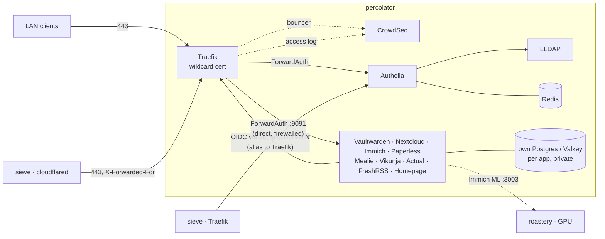

# percolator

**Ingress, identity and the household's daily apps** — `192.168.0.11`, ThinkCentre
M710q (i3-7100T, 16 GB). OS and Docker on the SATA SSD, `/srv/data` on the NVMe.

Everything a person opens in a browser or phone app lives here, behind one Traefik
and one sign-in.

| App | URL | What it's for |
|---|---|---|
| [Traefik](traefik/) | `traefik.${DOMAIN}` (admins) | HTTPS for everything, one wildcard certificate |
| [CrowdSec](crowdsec/) | — | Blocks abusive clients at Traefik |
| [LLDAP](lldap/) | `lldap.${DOMAIN}` | Household accounts and groups |
| [Authelia](authelia/) | `authelia.${DOMAIN}` | Single sign-on for every app |
| [Vaultwarden](vaultwarden/) | `vault.${DOMAIN}` | Passwords |
| [Nextcloud](nextcloud/) | `nextcloud.${DOMAIN}` | Files, calendars, contacts |
| [Immich](immich/) | `immich.${DOMAIN}` | Photos and videos |
| [Paperless-ngx](paperless/) | `paperless.${DOMAIN}` | Scanned documents |
| [Mealie](mealie/) | `mealie.${DOMAIN}` | Recipes and meal plans |
| [Vikunja](vikunja/) | `vikunja.${DOMAIN}` | To-do lists |
| [Actual Budget](actualbudget/) | `actualbudget.${DOMAIN}` | Budgeting |
| [FreshRSS](freshrss/) | `freshrss.${DOMAIN}` | News feeds |
| [Homepage](homepage/) | `homepage.${DOMAIN}` | Start page: a tile for every app |

Each app's folder has its own README: first run, sign-in setup, how to tell it works.

---

## How it fits together



- **One network for the web tier.** Traefik and each app's web container share the
  `proxy` network (`PROXY_SUBNET`, default `172.30.0.0/24`), so routing is by
  container name. Only Traefik publishes web ports; `compose.sh` creates the network.
- **One sign-in for the whole fleet.** Other nodes run their own Traefik and call
  Authelia's published port 9091 directly for ForwardAuth, because a second Traefik
  in the path drops `X-Forwarded-Method`. UFW opens 9091 to `FORWARD_AUTH_CLIENTS`
  only. If percolator is down, those nodes' protected pages fail closed.
- **Databases stay private.** Every Postgres and Valkey sits only on its own
  project's network. No app can reach another app's database.
- **Sign-in never depends on LAN DNS.** On `proxy`, `authelia.${DOMAIN}` is a
  network alias for Traefik. Apps fetch OIDC discovery and tokens through it with a
  valid certificate, even before Pi-hole has a record.
- **One wildcard certificate** (`${DOMAIN}` + `*.${DOMAIN}`) via Cloudflare DNS-01.
  No inbound port 80 is needed, and app names don't show up one by one in public
  certificate-transparency logs.
- **CrowdSec can fail without taking the house down.** The bouncer keeps serving with
  its last decisions if CrowdSec is unreachable, and never blocks LAN addresses.

## Before you start

1. **The node is provisioned** with `init/purrbrews-init.sh percolator` (static IP,
   Docker, `/opt/purrbrews/.env`, UFW + ufw-docker).
2. **A Cloudflare API token** for the domain's zone: *My Profile → API Tokens →
   Create Token → Edit zone DNS*, restricted to that one zone.
3. **LAN DNS for the app names.** Every name in the table above must resolve to
   `192.168.0.11` for LAN clients. Until sieve's Pi-hole serves them, add them to
   the router's local DNS or to a laptop's hosts file for testing. The apps
   themselves don't need this (see the alias above).
4. **For Immich's machine learning** (optional at first): roastery's address, and
   `immich-machine-learning` running there at the same version as `immich-server`,
   with its Windows Firewall rule for port 3003 scoped to `192.168.0.11`.

## Bring-up

All commands run on percolator as `barista` in `/opt/purrbrews/stacks/percolator`.
`compose.sh` uses `sudo docker` itself; don't prefix it with sudo.

```bash
./setup-secrets.sh          # asks for DOMAIN, ACME_EMAIL, roastery IP, Cloudflare token
                            # generates every secret, renders every config
sudo ./firewall.sh          # LAN → 80/443 on Traefik; FORWARD_AUTH_CLIENTS → 9091
```

Then bring apps up **one at a time, in this order**, and confirm each one's success
signal (in its README) before the next. "Container started" is not a success signal.

| # | Command | Success signal |
|---|---|---|
| 1 | `./compose.sh traefik up -d` | no ACME errors in `sudo docker logs traefik`; any `https://<anything>.${DOMAIN}` shows a valid wildcard padlock (a 404 page is fine at this point) |
| 2 | `./compose.sh crowdsec up -d` | `sudo docker exec crowdsec cscli bouncers list` shows `traefik` with a recent last pull |
| 3 | `./compose.sh lldap up -d` then `./lldap-bootstrap.sh` | groups exist, `barista` created — **save the printed one-time password** |
| 4 | `./compose.sh authelia up -d` | log in at `https://authelia.${DOMAIN}` as `barista`; the Traefik dashboard opens; from sieve, `curl -s -o /dev/null -w '%{http_code}' http://192.168.0.11:9091/api/health` gives `200` |
| 5+ | `./compose.sh <app> up -d` for vaultwarden, nextcloud, immich, paperless, mealie, vikunja, actualbudget, freshrss, homepage | the app's README checklist |

Once everything has been up once, `./compose.sh --all up -d` brings the whole node up
in that order, and `./compose.sh --all down` takes it down in reverse.

## Scripts

| Script | Does |
|---|---|
| `setup-secrets.sh` | First-time setup and re-run after pulling changes: `.env.local` (adds new keys), secrets, render |
| `generate-secrets.sh` | Creates missing secrets only. Hex values; OIDC client secret and Authelia's hash written together |
| `render-configs.sh` | Renders `*/config/*.template`. Refuses a template with an unset variable; lists every failure at the end |
| `compose.sh` | `docker compose` with the right env files. Before `up` it refuses placeholders and stale renders, creates data directories from `<app>/data-dirs`, and runs `<app>/prepare.sh` |
| `lldap-bootstrap.sh` | Creates the two groups and a user in both. Idempotent; `--dry-run` |
| `firewall.sh` | UFW route rules for Traefik (LAN) and Authelia's 9091 (`FORWARD_AUTH_CLIENTS`). Idempotent; `--dry-run` |

Files that exist only on the node (gitignored): `.env.local`, `*/secrets.env.local`,
rendered `*/config/*`.

## Day-2

```bash
./compose.sh <app> pull && ./compose.sh <app> up -d     # after bumping a tag in git
./compose.sh <app> logs -f --tail 100
./compose.sh <app> ps
git pull && ./setup-secrets.sh                          # picks up new keys, secrets, templates
sudo docker exec crowdsec cscli decisions list
sudo docker exec crowdsec cscli decisions delete --ip <address>   # unban
```

**Add a household member:** `./lldap-bootstrap.sh <username>` (creates them in both
groups and prints a one-time password), then remove them from `purrbrews_admins` in
LLDAP if they shouldn't reach the Traefik dashboard or be admin in Mealie.

**Rotate an OIDC client secret:** delete `<APP>_OIDC_CLIENT_SECRET` from
`<app>/secrets.env.local` and `<APP>_OIDC_CLIENT_SECRET_HASH` from
`authelia/secrets.env.local`, then `./generate-secrets.sh && ./render-configs.sh`,
`./compose.sh authelia up -d`, `./compose.sh <app> up -d`. Nextcloud and Immich keep
the secret in their own settings too; paste the new one there.

## Ports

| Port | Bound to | Owner |
|---|---|---|
| 80, 443 | all interfaces (UFW: LAN only) | Traefik |
| 9091 | all interfaces (UFW: `FORWARD_AUTH_CLIENTS` only) | Authelia, ForwardAuth for other nodes' Traefik |
| 17170 | 127.0.0.1 | LLDAP admin UI (break-glass: `ssh -L 17170:127.0.0.1:17170 barista@percolator`) |
| 22 | host (UFW: LAN only) | sshd, from init |

Nothing else is published. Check `sudo ss -tlnp` before adding a port.

## Data

Everything lives under `/srv/data/<app>/` on the NVMe:

| Path | Contents | Back up |
|---|---|---|
| `traefik/letsencrypt` | ACME account and certificate | optional (re-issued on demand) |
| `lldap` | user directory (SQLite) | **yes** |
| `authelia/data` | 2FA enrolments, consent (SQLite) | **yes** |
| `vaultwarden` | vaults (SQLite), attachments | **yes** |
| `nextcloud/html`, `nextcloud/postgres` | files, config, database | **yes** (database as a dump) |
| `immich/library`, `immich/postgres` | photos, database | **yes** (database as a dump) |
| `paperless/{data,media,export}`, `paperless/postgres` | documents, database | **yes** (database as a dump) |
| `mealie`, `vikunja`, `actualbudget`, `freshrss` | SQLite + files | **yes** |
| `crowdsec`, `traefik/logs`, `*/valkey`, `authelia/redis` | caches, logs, queues | no |

Never copy a running Postgres data directory as a backup; dump it
(`pg_dump`) and back up the dump. The dump job is not built yet (see the runbook).

## Gotchas

- **Run scripts as barista, never under sudo.** Root-owned secrets files break the
  next render. `compose.sh` and the scripts sudo the individual commands that need it.
- **After editing `.env.local` or a secrets file, re-render.** `compose.sh` refuses
  to start an app whose rendered config is older than its inputs.
- **A changed secret isn't picked up by a running container.** `./compose.sh <app> up -d`
  recreates it when its environment changed; for Authelia the rendered file changes,
  so use `./compose.sh authelia up -d --force-recreate`.
- **First-start-only values:** `LLDAP_LDAP_USER_PASS`, `NEXTCLOUD_ADMIN_PASSWORD`,
  `PAPERLESS_ADMIN_PASSWORD` and the database passwords only apply when the data
  directory is empty. Changing them later means changing them inside the app too.
- **Apps that read OIDC discovery at startup** (Actual Budget, Vikunja) restart or log
  errors until Authelia answers with a valid certificate. They recover on their own
  once step 4 is done.
- **Admin-only hosts must not be routed through the tunnel.** cloudflared on sieve
  should publish only the hostnames meant for outside use; `traefik.` and `lldap.`
  stay LAN-only.
