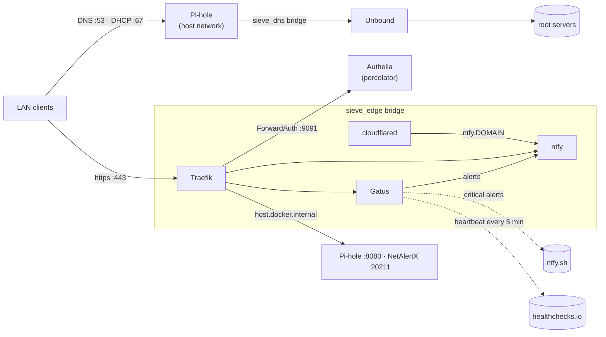

# sieve — network node

`sieve` (192.168.0.10) keeps the house online and says when something breaks. It
answers every DNS query and hands out every DHCP lease, carries the only way in from
the internet, and watches the rest of the fleet.

It deliberately runs nothing else. A network node that also hosts apps gets rebooted
for app reasons, and when it's down the whole house notices.

| App | Does | Reached at |
|---|---|---|
| [Pi-hole](pihole/README.md) | DNS with ad-blocking, DHCP, local names | `pihole.${DOMAIN}` (SSO) |
| [Unbound](unbound/README.md) | Recursive, validating resolver behind Pi-hole | sieve only |
| [cloudflared](cloudflared/README.md) | Outbound-only Cloudflare Tunnel | — |
| [Traefik](traefik/README.md) | HTTPS for sieve's own UIs | `traefik-sieve.${DOMAIN}` (SSO) |
| [ntfy](ntfy/README.md) | Push notifications to phones | `ntfy.${DOMAIN}` (own accounts; LAN + tunnel) |
| [Gatus](gatus/README.md) | Health checks and alerting | `gatus.${DOMAIN}` (SSO) |
| [NetAlertX](netalertx/README.md) | Device discovery, new-device alerts | `netalertx.${DOMAIN}` (SSO) |
| Komodo Periphery | Lets Komodo on cellar manage sieve's containers | — |
| Scrutiny collector | SMART data for the hub on cellar | — |

About 0.8 GB of RAM in total.

## How it fits together



- **DNS path.** Clients ask Pi-hole, and Pi-hole asks Unbound, which resolves from
  the root servers and validates DNSSEC. No third-party resolver sees the house's
  queries. Pi-hole also answers every Traefik host name in the repo with the IP of
  the node that serves it. The records are generated from the routers themselves, so
  a route and its DNS record can't drift apart.
- **Every node runs its own Traefik.** sieve's Traefik serves only sieve's UIs, so a
  broken proxy or a dead node takes down only that node's pages.
- **Login is still one SSO.** Traefik asks Authelia on percolator about every
  protected request, on Authelia's own port (the only hop that works; see
  [traefik/README.md](traefik/README.md#why-a-direct-hop-to-authelia)). If percolator
  is down, sieve's UIs fail closed. DNS, DHCP, the tunnel, ntfy and alerting keep
  working, and the [SSH fallback](#break-glass-access-without-sso) still opens every UI.
- **Alerting doesn't depend on the thing that failed.** Routine alerts go to ntfy on
  sieve. If ntfy or the tunnel is the problem, the alert goes out through public
  ntfy.sh instead. If sieve itself dies, its heartbeat to healthchecks.io stops and
  healthchecks.io raises the alarm.

## Layout

```
stacks/sieve/
├── README.md               this file
├── node.conf               app order, the sieve_edge network, RESOLVER=primary
├── local.env.example       node settings → .env.local
├── setup-secrets.sh        .env.local, every app's secrets, render (run first)
├── render-configs.sh       DNS records + leases, then *.template → rendered files
├── compose.sh              docker compose with the right env files; --all for every app
├── firewall.sh             UFW rules from each app's firewall file
├── enable-dhcp.sh          one-time DHCP handover (see pihole/README.md)
└── <app>/
    ├── docker-compose.yml
    ├── README.md
    ├── secrets.conf        what setup-secrets.sh generates or asks for (optional)
    ├── firewall            this app's UFW rules (optional)
    ├── data-dirs           directories created before `up` (optional)
    └── config/             tracked config, when the app needs files
```

The four scripts are the same three-line wrappers on every node; the logic is
in [`../_lib`](../README.md#the-shared-scripts).

`.env.local` and every `secrets.env.local` are gitignored and mode 600.

## First-time setup

Prerequisite: sieve was provisioned with `init/purrbrews-init.sh`, so it has its
static IP, Docker, UFW and the repo at `/opt/purrbrews`.

Have these ready:

- **The domain** — the zone you manage in Cloudflare.
- **A Cloudflare API token** for certificates — see [traefik/README.md](traefik/README.md#certificates).
- **A tunnel token** — see [cloudflared/README.md](cloudflared/README.md#create-the-tunnel).
- **A healthchecks.io ping URL** — see [gatus/README.md](gatus/README.md#heartbeat).

Any of the tokens can be skipped and added later; the app that needs it won't start
until then.

```bash
ssh barista@192.168.0.10
cd /opt/purrbrews/stacks/sieve

# Nothing may already own port 53 (Debian netinst normally has no local resolver)
sudo ss -tulpn | grep -E ':(53|67|80|443|8080|20211)\b' || echo "ports free"

./setup-secrets.sh      # asks for the domain and tokens; safe to re-run
sudo ./firewall.sh      # --dry-run first if you like
```

## Bring-up order

Each step has a check. Don't move on until it passes: a container that says "Up"
hasn't proven anything yet.

| # | Command | Check |
|---|---|---|
| 1 | `./compose.sh unbound up -d` | `docker logs unbound` ends in `start of service` |
| 2 | `./compose.sh pihole up -d` | `dig @192.168.0.10 cloudflare.com` answers; `dig @192.168.0.10 dnssec-failed.org` gives `SERVFAIL`; `dig @192.168.0.10 gatus.${DOMAIN} +short` gives `192.168.0.10` |
| 3 | `./compose.sh ntfy up -d` | `docker ps` shows `ntfy … (healthy)` |
| 4 | `./compose.sh cloudflared up -d` | Tunnel shows **Healthy** in Cloudflare; `curl https://ntfy.${DOMAIN}/v1/health` from a phone on mobile data |
| 5 | `./compose.sh traefik up -d` | Logs show certificates obtained for each host (no `unable to obtain`); `https://ntfy.${DOMAIN}` on home Wi-Fi shows a valid padlock |
| 6 | `./compose.sh gatus up -d` | Phones get a test alert (see [gatus/README.md](gatus/README.md)); healthchecks.io shows pings |
| 7 | `./compose.sh netalertx up -d` | After ~5 min, the device list shows real devices, not just the gateway |
| 8 | Point clients at sieve | Router DNS → 192.168.0.10, then [hand over DHCP](pihole/README.md#handing-over-dhcp) |
| 9 | Once Authelia runs on percolator | `https://gatus.${DOMAIN}` sends you to the login page, and lands on Gatus after it |
| 10 | `./compose.sh komodo-periphery up -d`, `./compose.sh scrutiny-collector up -d` | sieve shows up as a Server in Komodo and as a device in Scrutiny, both on cellar. Needs `komodo-periphery/keys/core.pub` copied from cellar first |

`sudo docker …` works too. `compose.sh` just adds the env files and runs sudo for you.
Once everything is up, `./compose.sh --all pull` and `./compose.sh --all up -d` update
the whole node in order.

## What percolator must provide

Only Authelia, and percolator's stack already provides it:

- **Port `9091` published**, with UFW allowing only `FORWARD_AUTH_CLIENTS`
  (`192.168.0.10`). Check from sieve:
  `curl -s -o /dev/null -w '%{http_code}\n' http://192.168.0.11:9091/api/health` → `200`.
- **Admin-only rules** for `pihole`, `gatus`, `netalertx` and `traefik-sieve`, above
  the household catch-all.
- **Session cookie domain `${DOMAIN}`**, so one login covers both nodes.

When you add a protected route on sieve, add its host to that admin list in
`stacks/percolator/authelia/config/configuration.yml.template`. Otherwise the
catch-all lets household members in.

Until Authelia is up, sieve's protected UIs answer `500` (fail closed); use the SSH
fallback. DNS, DHCP, ntfy, the tunnel and alerting don't depend on it.

## Break-glass access without SSO

Pi-hole and NetAlertX also listen on sieve's loopback, which neither the
firewall nor Authelia touches:

```bash
ssh -L 8080:localhost:8080 -L 20211:localhost:20211 barista@192.168.0.10
# http://localhost:8080/admin/ (Pi-hole) · http://localhost:20211 (NetAlertX)
# Gatus: sudo docker inspect gatus -f '{{range .NetworkSettings.Networks}}{{.IPAddress}}{{end}}'
#        then add  -L 8081:<that IP>:8080  and open http://localhost:8081
```

## Ports

Check this table before publishing anything new on sieve. Host-network apps and
published ports share one port space.

| Port | Proto | Owner | Open to |
|---|---|---|---|
| 22 | tcp | sshd | LAN (init) |
| 53 | tcp+udp | Pi-hole (host) | LAN, sieve_edge |
| 67 | udp | Pi-hole DHCP (host) | any (clients have no IP yet) |
| 80 | tcp | Traefik (published) | LAN — redirects to 443 |
| 443 | tcp | Traefik (published) | LAN |
| 8080 | tcp | Pi-hole web (host) | sieve_edge only (Traefik, Gatus) |
| 20211 | tcp | NetAlertX web (host) | sieve_edge only (Traefik, Gatus) |
| 20212 | tcp | NetAlertX API (host) | nobody |

Internal only, never on the host: Unbound `172.31.53.2:53`, ntfy `ntfy:8080`, Gatus
`gatus:8080`, Traefik ping `traefik:8080`, cloudflared metrics `cloudflared:2000`.

## Networks

| Network | Subnet | Members | Created by |
|---|---|---|---|
| `sieve_dns` | `172.31.53.0/28` | unbound (`.2`) | `unbound/docker-compose.yml` |
| `sieve_edge` | `172.31.10.0/24` | traefik, cloudflared, ntfy, gatus | `compose.sh` (shared, external) |

The subnets are fixed so that the firewall rules and Unbound's access list stay
valid across rebuilds. Change them in `.env.local`, and then in
`unbound/config/access-control.conf` too.

## Day 2

```bash
./compose.sh --all ps                    # everything at a glance
./compose.sh <app> logs -f --tail 50
./compose.sh <app> pull && ./compose.sh <app> up -d     # after bumping a tag
./setup-secrets.sh                       # after a pull that adds settings or secrets
./render-configs.sh                      # after a Traefik route is added anywhere in the fleet
./compose.sh pihole up -d                #   …then this, so Pi-hole picks up new DNS records
sudo ./firewall.sh                       # after a pull that changes an app's firewall file
```

The daily repo pull never restarts containers; redeploy changed apps yourself.

**Rebuilding sieve from scratch:** reprovision with init, then `setup-secrets.sh`,
`firewall.sh` and the bring-up order above. Settings that live in compose files come
back identical. What's lost without a backup of `/srv/data`: Pi-hole's query history,
NetAlertX's device names and Gatus's uptime history. Certificates are simply
reissued. The secrets are regenerated,
so phones need the new ntfy password, and the tunnel token must be copied from
Cloudflare again.

## Gotchas

- **Never two DHCP servers.** Sieve always enables DHCP in Compose. Disable DHCP
  on every router before starting Pi-hole. Router DHCP is a break-glass option
  only while sieve's Pi-hole is stopped.
- **sieve itself uses public DNS** (`BOOTSTRAP_DNS` from init), not its own Pi-hole.
  That way a broken Pi-hole can't stop sieve pulling the image that fixes it.
- **Don't run `setup-secrets.sh` or `render-configs.sh` with sudo.** They call sudo
  where needed; running them as root leaves root-owned files behind.
- **Removing a user from ntfy's config deletes that user** on the next restart. That
  is how provisioning works, and is intended.
